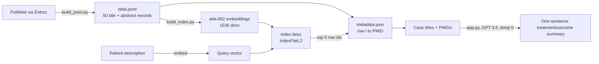

# Architecture

This document explains how the retrieval and summary pipeline fits together, why each design choice was made, and what the evaluation does and does not show.

## Pipeline



## Components

| File | Role | Needs API key |
| --- | --- | --- |
| `build_jsonl.py` | Pulls up to 50 meningitis case reports and reviews from PubMed and writes one JSON record per article | NCBI email |
| `build_index.py` | Embeds every record and writes `index.faiss` plus `metadata.json` | OpenAI |
| `query_cases.py` | Embeds a query and returns the k nearest PMIDs | OpenAI |
| `app.py` | Streamlit demo that retrieves and summarizes | OpenAI |
| `metrics.py` | Precision@k, recall@k, and mean, with no network calls | No |
| `evaluate_retrieval.py` | Precision@5 against five hand-labeled queries | OpenAI |
| `evaluate_summaries.py` | ROUGE-1 and ROUGE-L against reference summaries | OpenAI |
| `baseline.py` | Same precision@5 using a plain PubMed keyword search | NCBI email |

## Data contract

Each line of `data.jsonl` is:

```json
{"prompt": "Title: ...\nAbstract: ...\n\nRetrieve similar cases:", "metadata": {"pmid": "40622525", "source": "pubmed"}}
```

Row `i` in `index.faiss` corresponds to line `i` of `data.jsonl` and entry `i` of `metadata.json`. Retrieval returns row ids, so if these three files fall out of order, every result maps to the wrong paper. `tests/test_corpus.py` and `tests/test_index.py` check this alignment on every push.

## Design decisions

**Exact search (`IndexFlatL2`).** With 50 vectors, brute-force search takes microseconds and returns the true nearest neighbors. An approximate index such as HNSW or IVF would only make sense past tens of thousands of records.

**Title plus abstract, not full text.** Abstracts are free through Entrez and short enough to embed in one call. The cost is that summaries can only report what the abstract states.

**Temperature 0 for summaries.** The same case should always produce the same summary, which keeps the ROUGE evaluation repeatable.

**A keyword baseline.** `baseline.py` runs the same precision@5 metric over an ordinary PubMed search, so the embedding approach is compared against what a clinician would otherwise do.

## What the evaluation shows

Average precision@5 across the five gold queries is 0.24. Part of that is a coverage limit rather than a ranking failure: the relevant PMIDs for three of the five gold queries (40734865, 40735163, 40735311) are not in the 50-record corpus, so no ranking could score above zero on them. On the query whose relevant papers are all in the corpus, the score reflects ranking quality directly. Growing the corpus so every gold PMID is indexed is the most direct way to raise the number.

## Testing

```bash
pip install -r requirements-dev.txt
pytest -q
```

The tests run without an OpenAI key. They check the corpus format, PMID uniqueness, the alignment between the corpus, metadata, and index, that every stored vector retrieves itself first, and the metric functions. GitHub Actions runs them on every push and pull request.

## Known limitations

This is a research prototype, not a clinical tool. The corpus is small, the gold standard covers five queries, and `text-embedding-ada-002` and `gpt-3.5-turbo` have newer replacements that would likely improve both retrieval and summaries.
